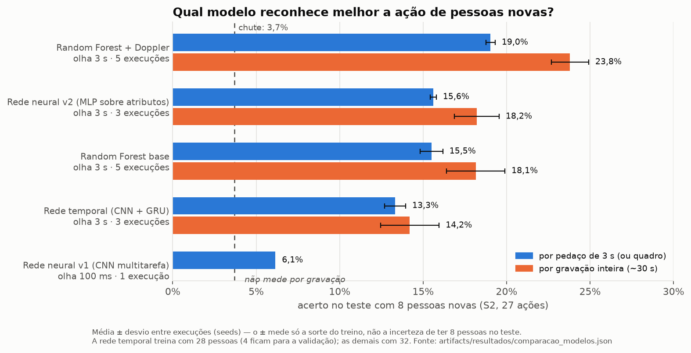
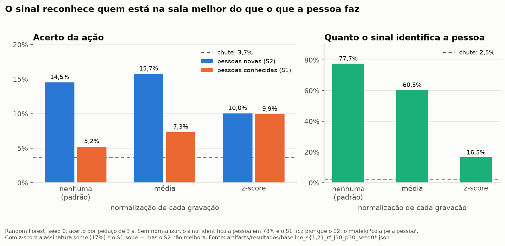
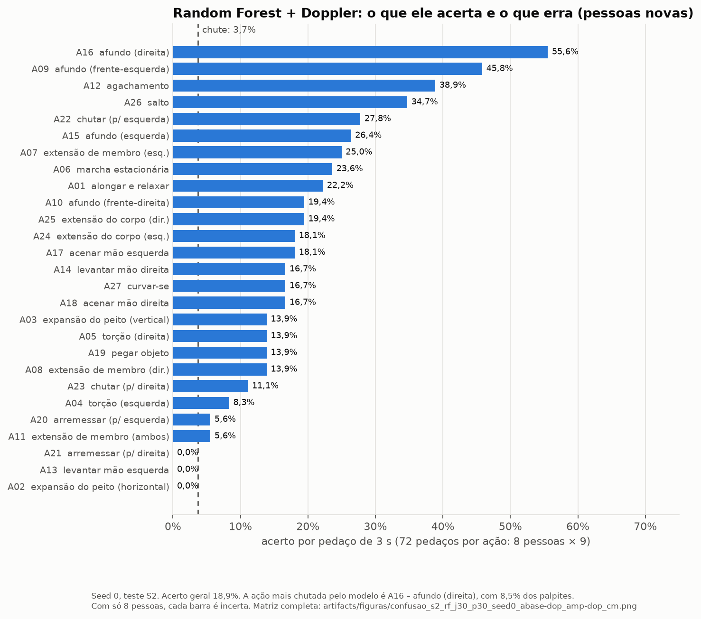
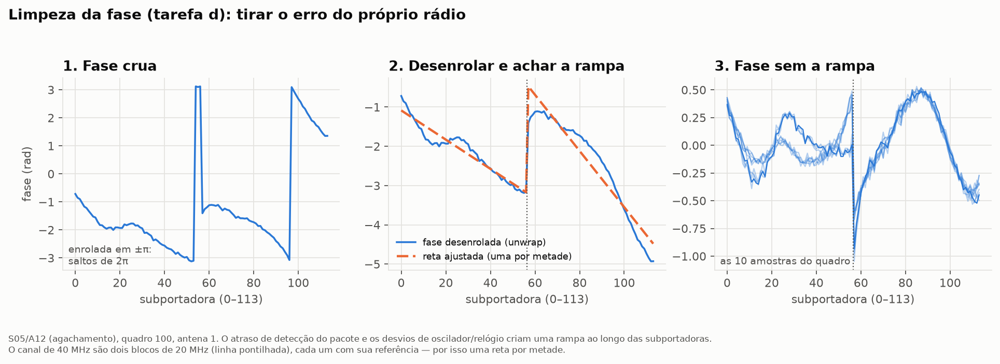
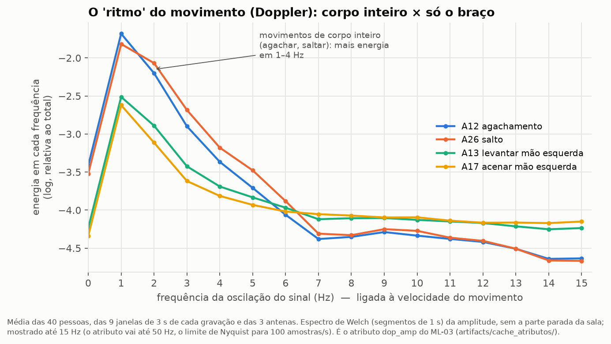

# Resumo do projeto — onde estamos e para onde vamos

**Atualizado em:** 11/11/2026

Um resumo direto do trabalho, para quem chegou agora ou quer se situar. Os
detalhes técnicos estão nos outros documentos de `docs/`.

---

## 1. A ideia do trabalho

O sinal de WiFi atravessa a sala e bate nas paredes, nos móveis **e nas
pessoas**. Quando alguém se mexe, o sinal que chega ao receptor muda um pouco.

A pergunta é: **dá para descobrir o que a pessoa está fazendo só olhando essas
mudanças no sinal, sem câmera?**

É parecido com um morcego, que não enxerga mas sabe onde as coisas estão pelo
eco. Aqui o "eco" é o WiFi. A vantagem sobre uma câmera é a privacidade: ninguém
é filmado.

---

## 2. O que o professor pede

São cinco tarefas, conforme o `tema.pdf`:

| | Tarefa | Em palavras simples |
|---|---|---|
| **a** | Revisão bibliográfica | Ler os dois artigos (Wi-Pose e Winect) e explicar o que cada um fez |
| **b** | Manipular os dados | Abrir os arquivos do sinal e fazer gráficos |
| **c** | Classificar movimentos | Um programa que olha o sinal e diz qual ação a pessoa está fazendo |
| **d** | Limpar o sinal | O sinal vem com ruído e distorção; tirar essa sujeira |
| **e** | Análise crítica | Mostrar onde o programa erra e explicar por quê |

O enunciado pede um modelo **simples** — não exige nada sofisticado.

---

## Resultados em gráficos

Gerados por `scripts/gerar_figuras_resultados.py` a partir dos resultados
medidos (`artifacts/resultados/`). Explicação de cada um nas seções abaixo.

**1. Qual modelo reconhece melhor a ação de pessoas novas (ML-04)**



**2. O sinal reconhece a pessoa melhor do que a ação (ML-02)**



**3. O que o melhor modelo acerta e o que erra (ML-03)**



**4. Limpeza da fase (tarefa d)**



**5. O "ritmo" do movimento — Doppler (ML-03)**



---

## 3. O que já foi feito

### Troca de dataset

O dataset indicado no enunciado (Wi-Pose) era incompleto: não trazia a **fase**
do sinal, só a amplitude, e as poses eram 2D. Trocamos para o **MM-Fi**:
**40 pessoas** fazendo **27 ações** (agachar, chutar, acenar, pular…) em
**4 salas diferentes**, gravadas com WiFi e com a pose 3D de referência. O
professor já está ciente da troca. O porquê completo está em
[`analise-mmfi.md`](analise-mmfi.md).

### Tarefa (b) — dados e gráficos ✅

Código que abre os dados do MM-Fi e desenha o sinal e o esqueleto 3D
(`src/mmfi.py`, `scripts/inspecionar_mmfi.py`). Também existe uma **versão
leve** do dataset (6 GB em vez de 16 GB), com um verificador de integridade.

### Tarefa (d) — limpeza do sinal 🟡

Primeira técnica implementada: **sanitização da fase**, que remove uma
distorção em forma de rampa que o próprio equipamento introduz no sinal.

### Tarefa (c) — primeiro classificador ✅

O primeiro "adivinhador" de ações:

1. Corta cada gravação em **pedaços de 3 segundos**.
2. Resume cada pedaço em números: para cada antena e cada frequência, a
   **média** do sinal (como a sala é) e o **quanto ele variou** (quanto o
   corpo mexeu no sinal).
3. Um modelo simples (**Random Forest** ou **SVM**) aprende a ligar esses
   números a uma das 27 ações.

**O teste foi feito do jeito honesto:** com pessoas que o modelo nunca viu no
treino, e sem nunca deixar pedaços da mesma gravação dos dois lados (isso faria
o modelo "colar" e inflaria a nota).

### Resultado

Chutando no escuro, a chance de acertar entre 27 ações é **3,7%** (1 em 27).

| Modelo | Pessoas novas no teste (S2) | Pessoas conhecidas (S1) |
|---|---|---|
| Random Forest | **14,5%** | 5,2% |
| SVM | **16,3%** | 6,4% |

*Acerto por pedaço de 3 s. Por gravação inteira, o SVM chega a 17,6% no S2.*

O modelo acerta **cerca de 4 vezes mais que o chute** com pessoas que nunca
viu. Parece pouco, mas é um começo honesto — e nem os autores do MM-Fi
publicaram esse número, então não há "nota certa" para comparar.

### A descoberta curiosa (vai para a tarefa e)

Com pessoas **conhecidas** (S1) o modelo foi **pior**, quase no chute. Por quê?

O modelo aprendeu a reconhecer **quem** está na sala (acerta a pessoa 78% das
vezes) melhor do que **o que** ela está fazendo. Cada corpo deixa uma
"assinatura" no sinal. No S1, o raciocínio dele vira: *"esse sinal parece do
Fulano; já vi o Fulano agachando, então é agachamento"* — mas a ação certa é
justamente uma que ele nunca viu o Fulano fazer. Com pessoas novas (S2) ele não
conhece ninguém e é obrigado a olhar o movimento.

Isso não é erro do código: é um achado real sobre o sinal de WiFi, e é
exatamente o tipo de coisa que a tarefa (e) pede para explicar.

As matrizes de confusão (quais ações o modelo confunde com quais) estão em
`artifacts/figuras/confusao_*.png`. Exemplo — SVM com pessoas novas:


Linhas = ação certa, colunas = palpite do modelo. Quanto mais escura a
diagonal, mais ele acerta. Repare na coluna **A01** ("alongar e relaxar"):
muitas ações são confundidas com ela.

### Experimento: apagar a "assinatura" da pessoa (ML-02)

Se o modelo reconhece **quem** está na sala, a ideia natural é apagar essa
assinatura antes de treinar. Testamos duas formas de **normalizar cada
gravação sozinha** (para cada antena e frequência, olhando só aquela gravação):

- **média:** tira o "nível de fundo" do sinal (subtrai a média);
- **z-score:** tira o nível de fundo **e** iguala o tamanho das oscilações
  (subtrai a média e divide pelo desvio).

Para saber se a assinatura sumiu mesmo, medimos também quanto os mesmos números
ainda **identificam a pessoa** (acaso: 1 em 40 = 2,5%).

Random Forest, seed 0, acerto por pedaço de 3 s (por gravação inteira entre
parênteses):

| Normalização | Pessoas novas (S2) | Pessoas conhecidas (S1) | Identifica a pessoa |
|---|---|---|---|
| nenhuma (padrão) | **14,5%** (15,3%) | 5,2% (5,2%) | **77,7%** |
| média | 15,7% (15,3%) | 7,3% (6,3%) | 60,5% |
| z-score | 10,0% (13,9%) | 9,9% (13,7%) | **16,5%** |

*Acaso: 3,7% para a ação, 2,5% para a pessoa. A coluna "identifica a pessoa" é
medida sempre na divisão S1 (no S2 as pessoas de teste nunca aparecem no
treino, então não dá para medir lá) e dá o mesmo valor nos JSON de S1 e de S2.
Os ICs 95% estão nos JSON `baseline_*_rf_j30_p30_seed0[_n<modo>].json`.
Todos os números vêm de **uma única seed (0)**.*

**Leitura em linguagem simples:**

- **A assinatura sai, sim.** Com z-score, o modelo deixa de reconhecer a pessoa
  (77% → 17%). Boa parte da "identidade" estava no nível e na escala do sinal
  de cada gravação.
- **Mas, com pessoas novas (S2), isso não ajuda.** A média fica igual dentro da
  margem de erro (14,5% → 15,7%). O z-score tende a piorar por pedaço
  (14,5% → 10,0%), mas as margens de erro se sobrepõem, e por gravação inteira
  fica parecido (15,3% → 13,9%). Uma explicação provável: junto com a
  assinatura vai embora informação útil sobre o movimento — o quanto o corpo
  mexe no sinal fica "achatado" quando dividimos pelo desvio.
- **Com pessoas conhecidas (S1), ajuda.** Sem a assinatura, o modelo para de
  "colar pela pessoa" e o S1 sobe de 5,2% para 9,9% (13,7% por gravação), ficando
  parecido com o S2. Isso confirma a explicação da seção anterior: o S1 baixo
  era culpa da assinatura.

**Decisão (20/10/2026, provisória por usar uma só seed):** fica registrado como
experimento. O padrão continua **sem normalização** — nenhuma das opções
melhorou o teste com pessoas novas, que é o que importa. A opção fica disponível para a análise (e) e para a rede neural:

```
.venv/Scripts/python.exe scripts/treinar_baseline.py --protocolo s2 --modelo rf --normalizacao zscore --diagnostico-sujeito
```

### Experimento: o "ritmo" do movimento — atributos de Doppler (ML-03)

Os números do classificador até aqui (média e desvio de cada antena) dizem
**quanto** o sinal mexeu, mas não **em que ritmo**. Um aceno e um agachamento
podem mexer "a mesma quantidade" no sinal, só que em velocidades diferentes. É
o mesmo efeito da sirene de ambulância que muda de tom quando passa (efeito
**Doppler**): o corpo em movimento faz o sinal de WiFi oscilar numa frequência
ligada à velocidade dele. Criamos três grupos novos de números para cada pedaço
de 3 s:

- **antenas:** a diferença entre as três antenas do receptor (cada uma "vê" o
  corpo de um ângulo um pouco diferente) — na força do sinal e no "atraso"
  (fase) entre elas, este guardado como cosseno e seno para não ter um "salto"
  artificial na volta do círculo;
- **dop_amp:** o "ritmo" com que a força do sinal oscila, de 0 a 50 vezes por
  segundo, em cada antena;
- **dop_cm:** o mesmo ritmo, mas comparando pares de antenas — o que também
  revela o **sentido** do movimento (aproximando ou afastando).

**Como escolhemos, sem colar.** Um teste rápido anterior já tinha indicado a
combinação vencedora, mas ela foi escolhida **olhando a nota da prova** (o
teste com pessoas novas) entre 8 opções — isso infla o resultado. Desta vez:

1. Separamos **4 pessoas do treino** (S04, S14, S24, S34 — uma de cada sala,
   nenhuma das 8 do teste) como um "simulado".
2. Treinamos cada uma das 5 combinações candidatas com as outras 28 pessoas e
   medimos no simulado, **3 vezes** (seeds 0, 1 e 2), para não depender da
   sorte de uma única rodada.
3. Ficou com a combinação de **maior acerto médio por gravação no simulado** —
   e essa escolha foi gravada **antes** de olhar o teste.
4. Só então a escolhida e o classificador antigo (`base`) foram treinados com
   as 32 pessoas do treino e avaliados **uma vez** no teste, com **5 seeds**.

Simulado (validação), Random Forest, média ± desvio de 3 seeds:

| Combinação | Nº de atributos | Acerto por pedaço de 3 s | Acerto por gravação |
|---|---|---|---|
| base (o de antes) | 1.368 | 12,2 ± 0,3% | 12,3 ± 0,5% |
| base + antenas | 3.078 | 11,8 ± 0,8% | 11,7 ± 0,5% |
| **base + dop_amp + dop_cm** | 1.821 | **14,9 ± 0,4%** | **17,6 ± 0,9%** |
| base + antenas + dop_amp + dop_cm | 3.531 | 13,0 ± 0,6% | 11,1 ± 0,0% |
| só dop_amp + dop_cm | 453 | 12,7 ± 1,2% | 15,1 ± 0,5% |

*O simulado tem só 4 pessoas (108 gravações), então cada número dele é
incerto: o IC 95% por gravação de uma seed tem ~13 pontos de largura (ex.:
escolhida, seed 0: 18,5%, IC [11,1–25,9]; base, seed 0: 12,0%, IC
[6,5–18,5]). O desvio entre seeds acima mede só a sorte do treino, não essa
incerteza.*

Teste com pessoas novas (S2), média ± desvio de 5 seeds (seeds 0–4):

| Combinação | Acerto por pedaço de 3 s | Acerto por gravação |
|---|---|---|
| **base + dop_amp + dop_cm** (escolhida) | **19,0 ± 0,3%** | **23,8 ± 1,1%** |
| base (o de antes) | 15,5 ± 0,7% | 18,1 ± 1,7% |

*Acaso: 3,7%. O IC 95% (bootstrap de gravações) de cada seed está em
`artifacts/resultados/selecao_atributos.json`; ele é largo — por exemplo, seed
0 da escolhida por gravação: 25,0%, IC [19,4–30,6]; do base: 15,3%, IC
[10,6–20,4]. O desvio entre seeds mede só a sorte do treino; o IC mede a
incerteza de ter só 216 gravações no teste.*

Como as duas são medidas **nas mesmas 216 gravações**, dá para comparar de
forma **pareada**: sorteamos gravações do teste com reposição (2.000 vezes),
sempre as mesmas para as duas, e olhamos a diferença escolhida − base.

| Diferença escolhida − base | Por pedaço de 3 s | Por gravação |
|---|---|---|
| seed 0 | +4,4 pp [+2,1; +7,0] | +9,7 pp [+4,6; +14,8] |
| seed 1 | +3,0 pp [+0,6; +5,3] | +5,6 pp [+0,5; +10,6] |
| seed 2 | +3,5 pp [+0,8; +6,1] | +3,7 pp [−1,4; +8,8] |
| seed 3 | +4,1 pp [+1,4; +6,7] | +6,0 pp [+0,5; +11,1] |
| seed 4 | +2,7 pp [+0,5; +4,9] | +3,2 pp [−1,9; +8,3] |
| **média das 5 seeds** | **+3,5 pp [+1,7; +5,5]** | **+5,6 pp [+1,6; +9,5]** |

*pp = pontos percentuais; entre colchetes, o IC 95% do bootstrap pareado. Na
média das seeds, a diferença foi ≤ 0 em nenhuma das 2.000 reamostras por
pedaço e em 0,35% delas por gravação.*

**Leitura em linguagem simples:**

- **O ritmo do movimento ajuda.** Com os atributos de Doppler, o acerto com
  pessoas novas sobe de ~15,5% para **~19%** por pedaço e de ~18% para
  **~24%** por gravação — de **5 a 6 vezes o chute**. Na comparação pareada, a
  melhora média (+3,5 pp por pedaço, +5,6 pp por gravação) tem IC inteiro
  acima de zero; por gravação, em 2 das 5 seeds o IC ainda inclui zero.
- **O Doppler sozinho já supera o base no simulado** (15,1% contra 12,3% por
  gravação; 12,7% contra 12,2% por pedaço), com só 453 números contra 1.368.
  Mas junto com o base fica melhor ainda: o "quanto mexeu" e o "em que ritmo"
  se completam.
- **A diferença entre antenas não ajudou.** Somada só ao base, fica parecida
  com ele (11,8% contra 12,2% por pedaço; 11,7% contra 12,3% por gravação —
  dentro da incerteza do simulado). A queda clara é quando entra **junto do
  Doppler**: 14,9% → 13,0% por pedaço e 17,6% → 11,1% por gravação. Uma
  explicação provável: ela quase dobra o número de atributos com informação
  que muda de pessoa para pessoa (a posição do corpo em relação às antenas), e
  a Random Forest passa a usá-la no lugar do Doppler.
- **Cuidado com o tamanho da melhora:** o teste tem só 8 pessoas, e o simulado
  só 4.

**Limitações que ficam registradas:**

- **A escolha reduz o viés, mas não o elimina.** As 5 candidatas vieram de um
  protótipo que **já tinha comparado combinações no teste**. Escolher entre
  elas pelo simulado evita escolher "a que foi melhor na prova", mas a lista de
  candidatas em si já foi influenciada pela prova.
- **Só Random Forest, só S2 com as 27 ações (P3).** O script de seleção não
  testa SVM, o S1 nem os protocolos P1/P2.
- **O eixo de frequência supõe amostragem uniforme a 100 Hz** (10 amostras por
  quadro de 100 ms). O MM-Fi não informa o instante de cada amostra; se o
  intervalo real variar, os "ritmos" medidos ficam borrados ou deslocados.

**Como rodar:**

```
.venv/Scripts/python.exe scripts/selecionar_atributos.py
.venv/Scripts/python.exe scripts/treinar_baseline.py --protocolo s2 --modelo rf --atributos base,dop_amp,dop_cm
```

Na primeira vez, os atributos de Doppler são calculados a partir do dataset e
guardados em `artifacts/cache_atributos/` (~6 min medidos, ~80 MB). O padrão do
`treinar_baseline.py` continua `base`, igual ao de antes.

### Comparação dos modelos (ML-04)

O grupo tem agora **cinco** abordagens para a tarefa (c). Para saber qual é o
estado real, rodamos todas **na mesma prova** — o teste S2 oficial, com as 8
pessoas que nenhum modelo viu (216 gravações, 27 ações) — e, quando deu,
**mais de uma vez** cada, para não depender da sorte de uma rodada:

- **RF base** e **RF + Doppler**: os classificadores do ML-01 e do ML-03
  (números do `selecao_atributos.json`, 5 seeds).
- **Rede temporal (ML-04)**: uma rede neural nova, nossa. Cada pedaço de 3 s
  vira uma sequência de 30 "fotos" do sinal (amplitude e fase das 3 antenas);
  uma parte convolucional resume cada foto e uma parte recorrente (GRU) lê as
  30 em ordem, procurando o padrão do movimento no tempo (~286 mil
  parâmetros). A época final foi escolhida no **simulado** (S04, S14, S24,
  S34, retirados do treino), e o teste foi avaliado uma vez só. 3 seeds (0,
  1, 2).
- **Redes neurais v1 e v2**: as duas versões da rede neural do grupo
  (`src/rede_neural.py`), rodadas **com o código original, sem nenhuma alteração**, cada uma numa cópia temporária do repositório
  (`git worktree`) que é apagada no fim. A **v1** (`main`, commit `98a1f49`) é uma
  CNN multitarefa (ação + pose 3D) que olha **um quadro de 100 ms por vez**; a **v2** (branch `rede-neural-sml`,
  commit `68d96a9`) é uma rede densa (MLP residual) sobre os atributos de
  pedaços de 3 s, como os do RF.

Teste S2, média ± desvio entre execuções (seeds):

| Modelo | O que cada amostra é | Acerto por pedaço / quadro | Acerto por gravação | Execuções | Pessoas no treino | Escolhido sem olhar o teste? |
|---|---|---|---|---|---|---|
| RF base (ML-01) | pedaço de 3 s | 15,5 ± 0,7% | 18,1 ± 1,7% | 5 | 32 | sim (configuração fixa) |
| **RF + Doppler (ML-03)** | pedaço de 3 s | **19,0 ± 0,3%** | **23,8 ± 1,1%** | 5 | 32 | sim, no simulado ¹ |
| Rede temporal (ML-04) | pedaço de 3 s ⁴ | 13,3 ± 0,6% | 14,2 ± 1,8% | 3 | **28** | sim, época no simulado |
| Rede neural v1 — CNN multitarefa, quadro de 100 ms | **quadro de 100 ms** | 6,1% | — (não mede) | 1 ² | 32 | parcial ³ |
| Rede neural v2 — MLP sobre atributos de 3 s | pedaço de 3 s | 15,6 ± 0,2% | 18,2 ± 1,3% | 3 | 32 | parcial ³ |
| *Acaso (1 em 27)* | — | *3,7%* | *3,7%* | — | — | — |

*¹ As 5 combinações candidatas vieram de um protótipo que já tinha olhado o
teste (ver ML-03). ² Uma execução em vez de 3, por decisão do usuário, por
tempo: ela dividiu a CPU com a rede temporal e levou ~107 min (medido); como o
script dela não tem seed, execuções extras só mediriam o ruído do treino.
³ **Parcial:** os scripts da rede neural v1/v2 reportam a última época (número de épocas
fixado antes de rodar), então o número não é escolhido pelo teste; mas não há
simulado — o script mostra o teste a cada época, e o número de épocas e os
outros hiperparâmetros foram definidos pelo autor, que via o teste. O melhor
teste entre as épocas teria sido 6,4% (v1) e 19,4–21,3% por gravação (v2),
perto do reportado. ⁴ Antes de cortar os pedaços, a rede tira de cada gravação
a média da gravação **inteira** (como a opção `media` do ML-02); então mesmo o
acerto "por pedaço" dela usa um pouco de informação do resto da gravação.*

*O "acerto por quadro" da v1 não é comparável direto com o "por pedaço" dos
outros: um quadro de 100 ms tem muito menos informação que 3 s de sinal, e a
v1 não junta os quadros de uma gravação. Por isso a coluna "por gravação"
dela fica vazia em vez de receber um número de outra unidade.*

**Quanto confiar nesses números.** O "±" mede só a sorte do treino (seeds
diferentes), não a incerteza da prova. O IC 95% de cada execução está nos JSON
do RF e da rede temporal (~±5 pontos por gravação; os JSON da rede neural v1/v2 não
trazem IC), mas ele sorteia gravações como se fossem independentes, e elas
vêm de só 8 pessoas — então até esse IC é otimista. E só uma comparação foi
feita de forma **pareada** (as mesmas gravações, sorteadas juntas): RF +
Doppler × RF base, no ML-03, em que o Doppler ganhou com IC acima de zero.
Entre os demais, a tabela mostra o **maior número observado**, não uma
classificação provada.

**Leitura em linguagem simples:**

- **O RF + Doppler teve o maior número observado**: ~19% por pedaço e ~24%
  por gravação, 5 a 6 vezes o chute. Nenhuma rede neural chegou perto, mas a
  diferença para elas não foi testada de forma pareada.
- **A rede neural v2 ficou praticamente igual ao RF base** (15,6% contra 15,5%
  por pedaço; 18,2% contra 18,1% por gravação). Faz sentido: ela recebe
  praticamente os mesmos 1.368 números por pedaço que o RF base (média e
  desvio por antena × subportadora), só troca a Random Forest por uma rede.
- **A nossa rede temporal ficou abaixo do RF base** (13,3% contra 15,5% por
  pedaço). No simulado ela parecia bem melhor (20–25% por gravação na época
  escolhida), mas o simulado tem só 4 pessoas: escolher a "melhor época" num
  grupo tão pequeno pega muita sorte, e a melhora não se repetiu nas 8
  pessoas do teste. Ela também **treinou com menos gente**: 28 pessoas, porque
  4 ficaram para o simulado e não houve um retreino com as 32 — os outros
  modelos usaram as 32, então parte da diferença pode ser só quantidade de
  dados. Outra explicação provável (não testada): com poucas pessoas, uma
  rede que vê o sinal "cru" aprende detalhes de cada pessoa em vez do
  movimento; os atributos prontos do RF já resumem o que importa.
- **A rede neural v1 fica perto do chute** (6,1% contra 3,7%): um quadro de
  100 ms isolado quase não carrega o movimento. Esse número vem de uma nova
  execução, sem seed; o README cita 5,74% (pico de 6,11%) de uma execução
  anterior. Sem seed não dá para reproduzir aquela execução, então a diferença
  provavelmente é só o ruído entre execuções.

**Como rodar:**

```
.venv/Scripts/python.exe scripts/treinar_rede_temporal.py --seed 0 1 2
.venv/Scripts/python.exe scripts/rodar_rede_neural.py
.venv/Scripts/python.exe scripts/comparar_modelos.py
```

Resultados em `artifacts/resultados/rede_temporal_s2_seed<seed>.json`,
`rede_neural_v<1|2>_exec<i>.json` e `comparacao_modelos.json`; matrizes de
confusão da rede temporal em `artifacts/figuras/confusao_rede_temporal_s2_seed<seed>.png`.
Tempos medidos aqui, com a CPU dividida entre os treinos: rede temporal
43–45 min por seed, rede neural v2 5–12 min por execução, v1 ~107 min (o README
cita ~16 min sozinha, não medido aqui). O script da rede neural v2 usa
`Optional` sem importá-lo e não chega a rodar; `rodar_rede_neural.py`
contorna isso sem editar o arquivo original (põe o nome disponível antes de
executá-lo) e registra o contorno no JSON.

---

## 4. O que falta fazer

1. ~~Tirar a "assinatura" da pessoa do sinal~~ — testado (ML-02, acima): a
   assinatura sai, mas o resultado com pessoas novas não melhora. Fica como
   opção (`--normalizacao`) para a rede neural testar de novo.
2. ~~Dar ao classificador o "ritmo" do movimento~~ — feito (ML-03, acima):
   com Doppler, o S2 sobe de ~15,5% para ~19% por pedaço (~24% por gravação),
   com a combinação escolhida no simulado, sem olhar o teste.
3. ~~Rede neural comparada ao classificador simples~~ — feito (ML-04, acima):
   a rede temporal (convolucional + recorrente) e as duas versões da rede neural (v1 e v2)
   tiveram números menores que o RF + Doppler no S2 (diferença não testada de
   forma pareada).
4. **Terminar a análise (e):** quais ações se confundem (ex.: chutar com a
   perna esquerda × direita), se a fase limpa ajuda, quais antenas e
   frequências atrapalham.
5. **Terminar a tarefa (d):** comparar técnicas de limpeza do sinal.
6. **Escrever a revisão dos artigos (a).**
7. **Juntar tudo no relatório.**

**Em uma frase:** o trabalho é ensinar o computador a "ver" movimentos pelo
WiFi; o maior número até aqui é o do modelo simples com Doppler (RF +
Doppler), 5 a 6 vezes o chute — as redes neurais testadas ficaram abaixo dele
nesta prova —, e agora falta explicar os erros.

---

## 5. Como rodar o classificador

Com o ambiente e o dataset configurados (ver o [README](../README.md)):

```
.venv/Scripts/python.exe scripts/treinar_baseline.py --protocolo s2 --modelo rf
```

<sub>Linux/macOS: `.venv/bin/python` no lugar de `.venv/Scripts/python.exe`.</sub>

Na primeira vez ele monta uma base consolidada em `artifacts/cache/` (~3–4 min,
~8 GB em disco). Depois, cada treino leva de **1 a 3 minutos** num notebook
comum, sem GPU. As figuras saem em `artifacts/figuras/` e os números completos
em `artifacts/resultados/`.
